# PharmaTrace

PharmaTrace is a blockchain-based drug verification system for Rwanda that lets regulators register and approve medicine batches on Ethereum smart contracts, and lets patients and pharmacists instantly verify a drug's authenticity by scanning a QR code.

**GitHub repo:** [[https://github.com/TammyBriggs/PharmaTrace](https://github.com/TammyBriggs/PharmaTrace)]
**Track:** Low Level (smart contracts, data visualization, security)
**Author:** Tamunotonye Briggs

---

## Project status (initial demo)

| Component | Status |
|---|---|
| Smart contract (`contracts/PharmaTrace.sol`) | Built and compiling |
| Blockchain activity simulation (`scripts/simulate.js`) | Built |
| On-chain data visualization (`viz/index.html`) | Built |
| Security measures (contract level) | Built |
| Mobile app and web dashboard | Figma mockups only (see Designs) |
| Node.js API, PostgreSQL, testnet deployment | Planned (see Deployment plan) |

---

## How it works

1. A **regulator** (Rwanda FDA) registers licensed manufacturers.
2. A **manufacturer** submits a batch. It starts as `Pending`.
3. A **regulator** approves the batch. It becomes `Approved` and counts as authentic.
4. A regulator can **flag** a batch at any time (for example, a failed lab test).
5. **Anyone** can verify a batch for free with no wallet. The contract returns one verdict, and each verdict maps to one mobile-app result screen:
   `Authentic`, `Pending`, `Flagged`, `Expired`, `ManufacturerRevoked`, `NotFound`.

| Role | Can do |
|---|---|
| Admin (`DEFAULT_ADMIN_ROLE`) | Pause or unpause the contract |
| Regulator (`REGULATOR_ROLE`) | Register or revoke manufacturers, approve, flag, resolve flags |
| Manufacturer (`MANUFACTURER_ROLE`) | Submit batches |
| Anyone | Verify a batch (read-only) |

The chain stores only wallet addresses, timestamps, status flags and hashes. Names, licence numbers, drug details and flag reasons stay in an off-chain Rwanda-hosted database and are anchored on-chain by hash (Rwanda Law No. 058/2021).

---

## Setup

### Prerequisites
- [Node.js](https://nodejs.org) v18 or v20 (LTS)
- npm (comes with Node.js)
- Git
- A modern web browser

### Install and run

```bash
# 1. Clone the repo
git clone https://github.com/TammyBriggs/PharmaTrace.git
cd PharmaTrace

# 2. Install dependencies (Hardhat, OpenZeppelin, ethers)
npm install

# 3. Compile the smart contract
npx hardhat compile

# 4. Run the blockchain simulation (local in-process chain, no wallet or internet needed)
npx hardhat run scripts/simulate.js

# 5. Open the visualization in your browser
#    macOS: open viz/index.html | Windows: start viz/index.html | Linux: xdg-open viz/index.html
```

`simulate.js` deploys the contract on a local Hardhat chain and replays about four weeks of activity as real transactions: 35 batches from 5 manufacturers, including **5 flagged batches**, pending and expired batches, a revoked manufacturer, and one false alarm that is cleared. It writes the results to `viz/chain-data.js`, which the visualization page reads.

### Optional: environment variables
Local simulation needs none. 
**Never commit `.env`.**

---

## Project structure

```
pharmatrace/
├── contracts/
│   └── PharmaTrace.sol        # Smart contract
├── scripts/
│   └── simulate.js            # Deploys and simulates 4 weeks of activity
├── test/                      # Contract tests (planned)
├── viz/
│   ├── index.html             # On-chain data visualization
│   └── chain-data.js          # Generated by simulate.js
├── docs/
│   ├── designs/               # Figma exports (mobile + dashboard)
│   └── screenshots/           # Visualization screenshots
├── hardhat.config.js
├── package.json
├── .env.example
└── README.md
```

---

## Data visualization

The visualization is built from real transactions on the simulated chain. It shows:

- **Transaction graph:** FDA, manufacturers and batches, with each batch colored by its verdict
- **Transactions per day**, with flag transactions highlighted in red
- **Batch verdicts:** the result a QR scan would return
- **Transactions by type**, and the latest transactions with truncated hashes

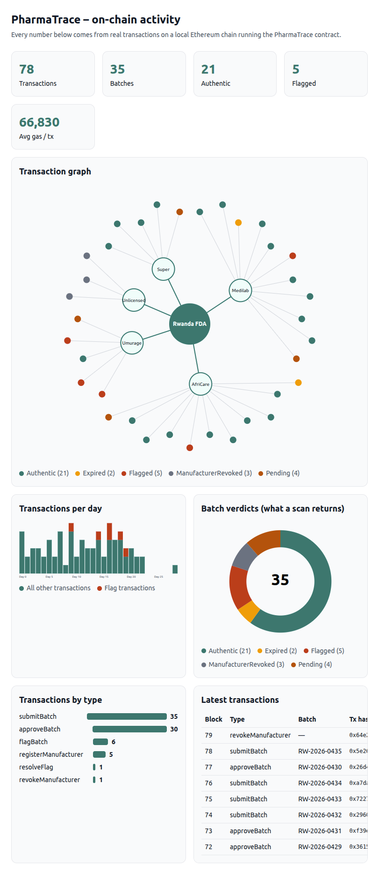

> Scan activity (the heatmap and suspicious-scan alerts on the dashboard) is off-chain data. Scans are free read calls, so they never appear on the chain.

---

## Security measures

| Threat | Measure | Status |
|---|---|---|
| Unauthorized writes | Role-based access control (OpenZeppelin `AccessControl`) with separate admin, regulator and manufacturer roles | Built |
| Manufacturer approves its own batch | Submit and approve are separate roles | Built |
| Rogue or compromised manufacturer | `revokeManufacturer` turns all their batches into `ManufacturerRevoked` | Built |
| Bad input | Custom errors, validation (expiry in the future, non-empty batch number, no duplicates), no unbounded loops | Built |
| Live incident | Admin `pause()` stops writes, while `flagBatch` stays callable so a recall can never be blocked | Built |
| Personal data on-chain | Only addresses, timestamps, statuses and hashes are stored | Built |
| Tampering with history | Append-only events plus blockchain immutability | Inherent |
| API abuse | JWT, rate limiting, helmet, input validation, HTTPS | Planned |
| Key theft | Secrets in environment variables, regulator signing in the user's wallet | Planned |
| Cloned QR code on a fake pack | Known limitation. Mitigation: scan-anomaly detection on the dashboard. Unit-level serialization is future work | Planned |

> The simulation registers the admin wallet as a manufacturer too ("Super Admin" for demo purpose) so one account can run the whole demo. This is a demo shortcut. In production the roles sit on separate wallets.

---

## Designs

> Circuit diagram / PCB: **not applicable.** PharmaTrace has no hardware or IoT component.

### Mobile app (patients and pharmacists)

| Screen | Preview |
|---|---|
| Welcome / onboarding | 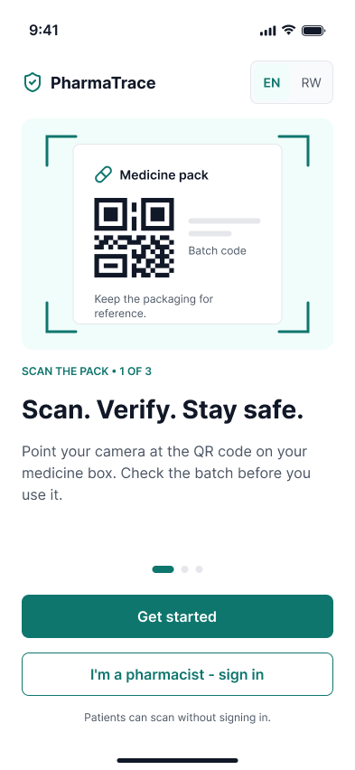 |
| Scan | 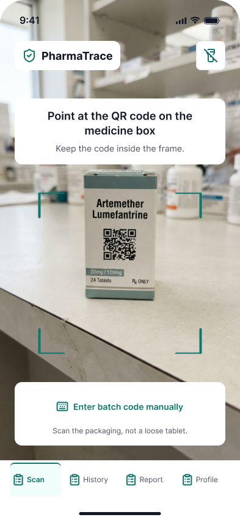 |
| Result: Authentic | 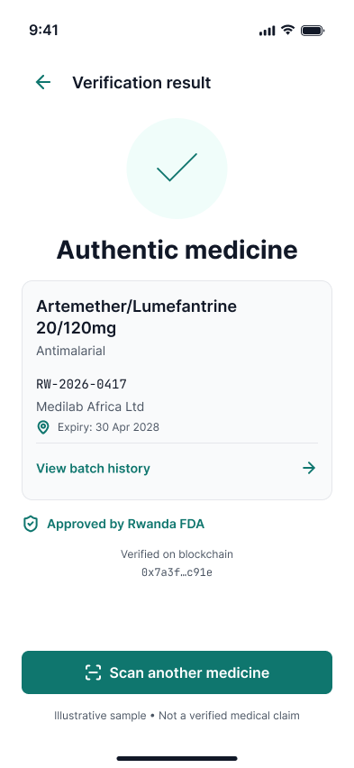 |
| Result: Flagged | 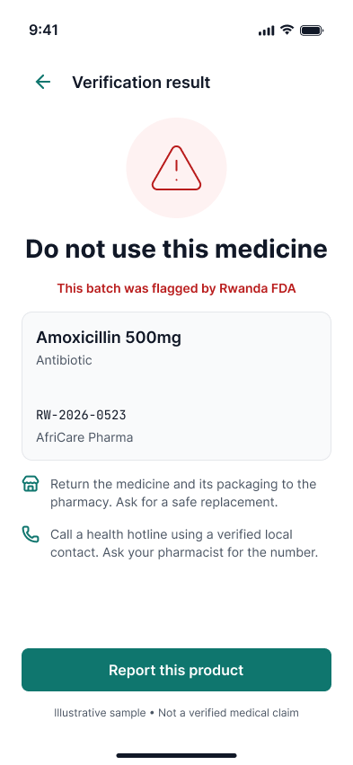 |
| Result: Expired / Pending / Not found | 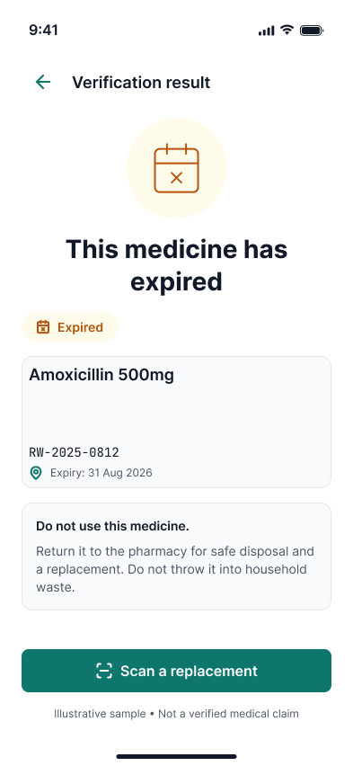 |
| Batch history | 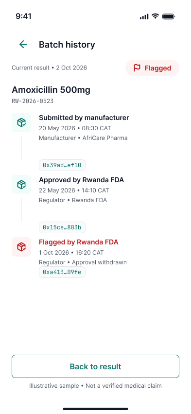 |
| Report suspicious drug | 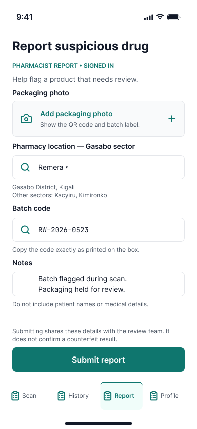 |

### Web dashboard (regulators and administrators)

| Screen | Preview |
|---|---|
| Login | 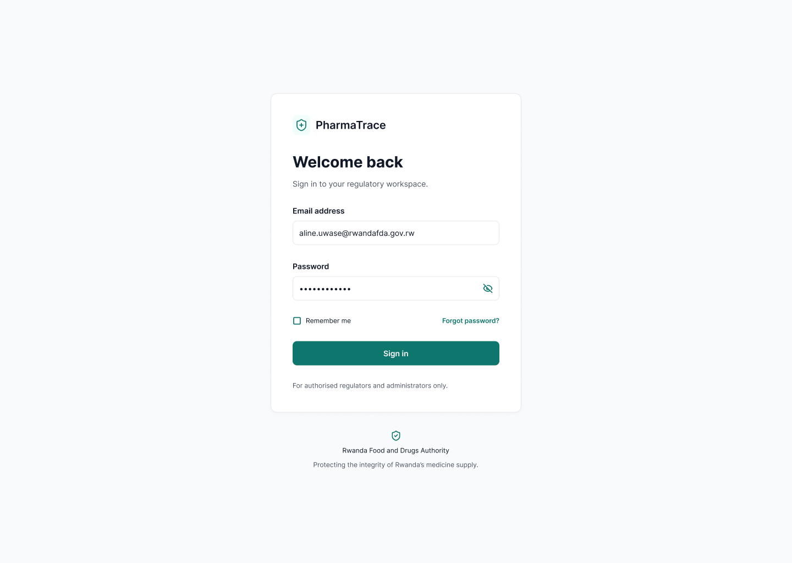 |
| Overview | 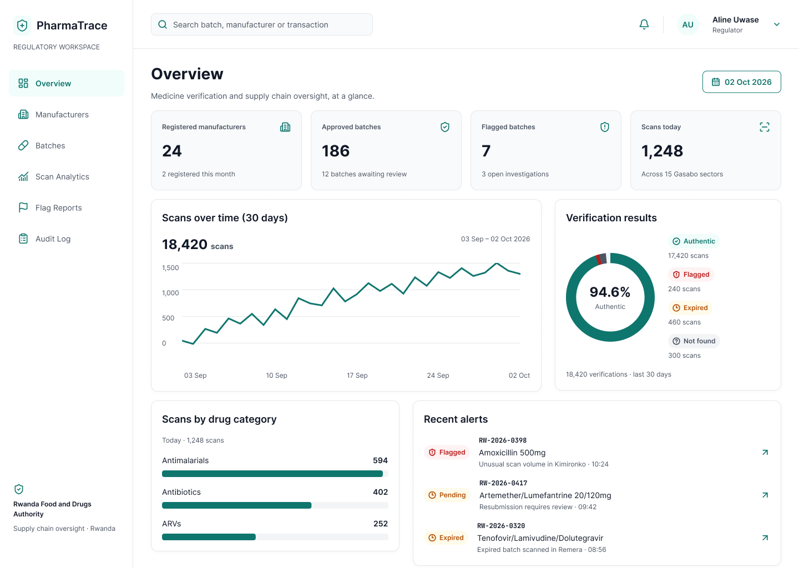 |
| Manufacturers | 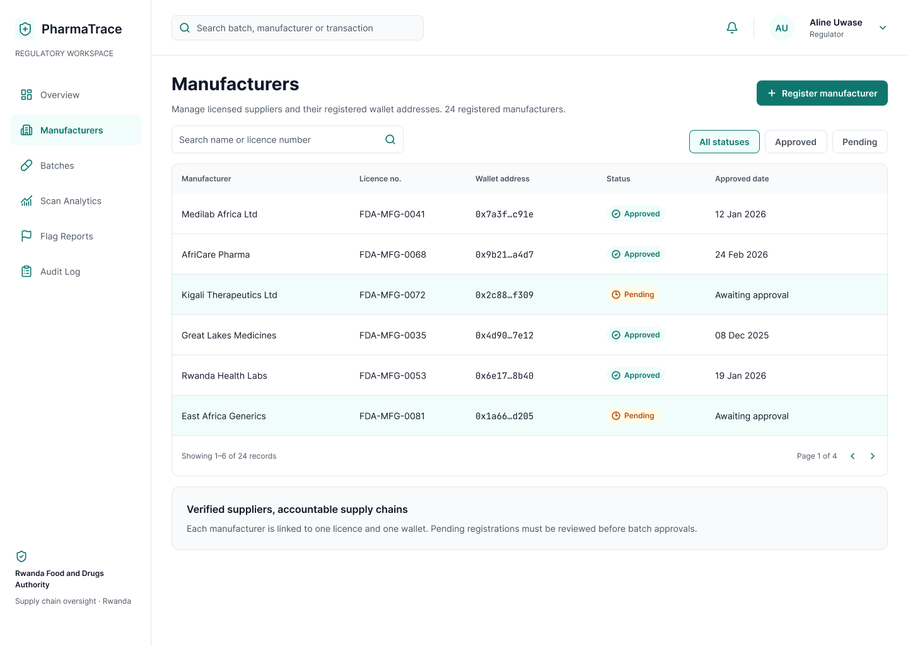 |
| Batches | 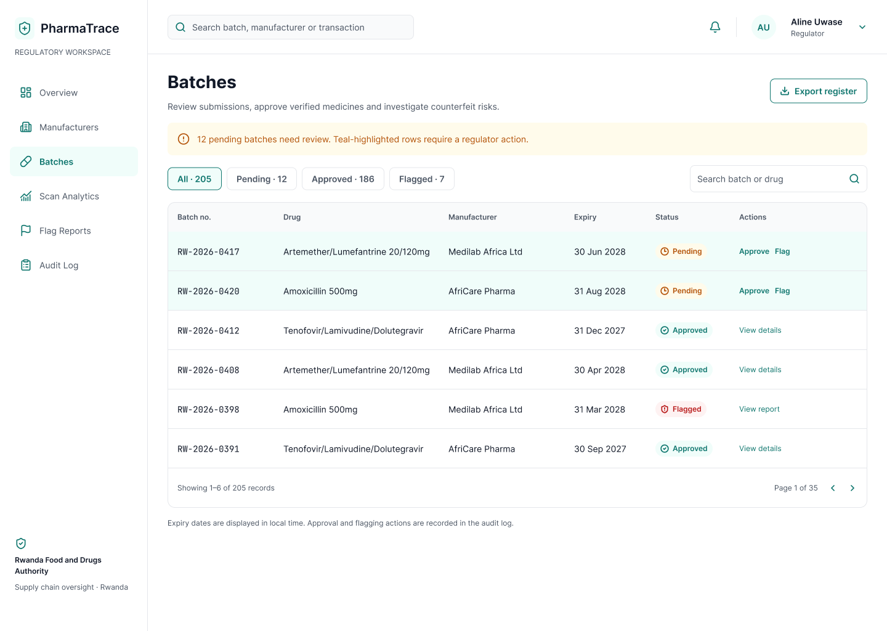 |
| Batch detail | 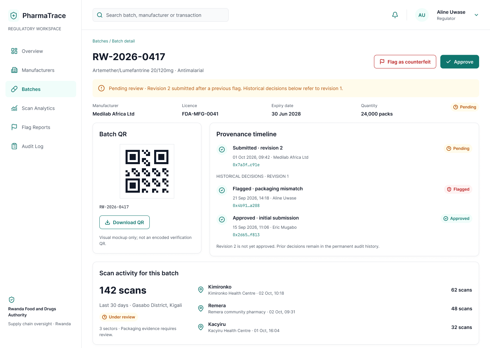 |
| Scan analytics | 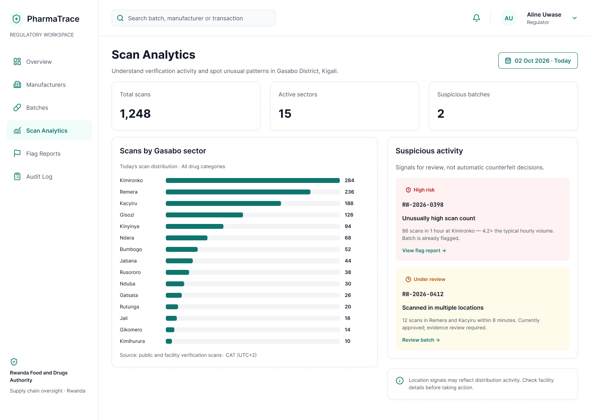 |
| Audit log | 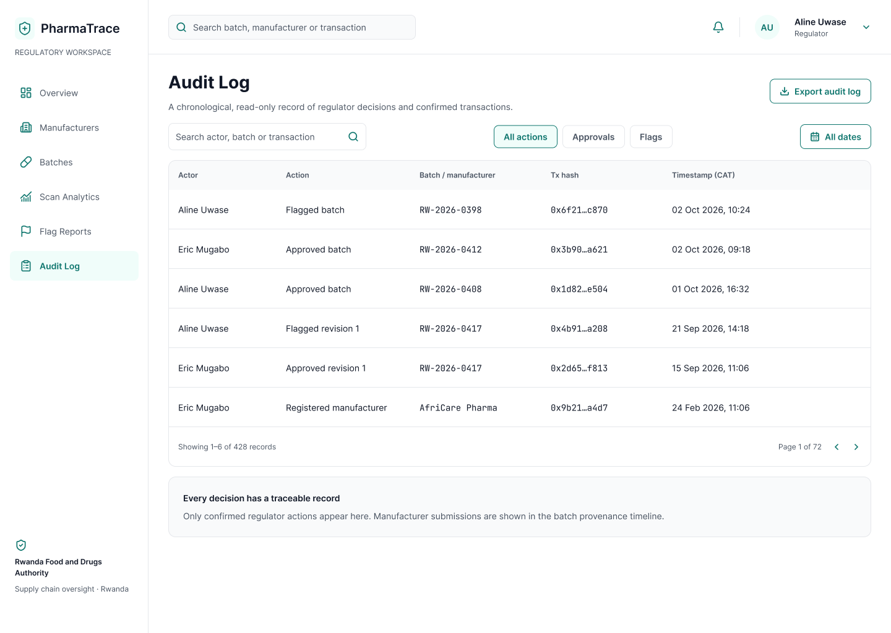 |

**Figma prototype:** [LINK TO FIGMA FILE]

**Style guide:** white background, near-black text (`#111827`), teal (`#0F766E`) for buttons, links and icons, Inter typeface. Red and amber are used only for verification results and alerts, always with an icon and a text label.

---

## Deployment plan

| Phase | What | Status |
|---|---|---|
| 1. Local | Contract runs on a local Hardhat chain, with simulated data and visualization | Done |
| 2. Testnet | Deploy to an Ethereum testnet (Sepolia) using a `deploy.js` script and a funded test wallet, then verify the source on a block explorer | Planned |
| 3. Backend | Node.js REST API (reads `verifyBatch` and contract events, JWT auth, rate limiting) and PostgreSQL hosted in Rwanda for data residency, behind HTTPS | Planned |
| 4. Clients | Mobile app and web dashboard consume the API, with regulator transactions signed in the user's wallet | Planned |
| 5. Pilot | Onboard a small set of manufacturers with Rwanda FDA, monitor scan anomalies, then decide on the production network | Planned |

**Production considerations:** regulator and admin keys should sit in a hardware wallet or multisig, and the final network choice (public chain, Layer 2 or permissioned) will be decided at the pilot stage based on cost and governance.

---

## License

MIT
